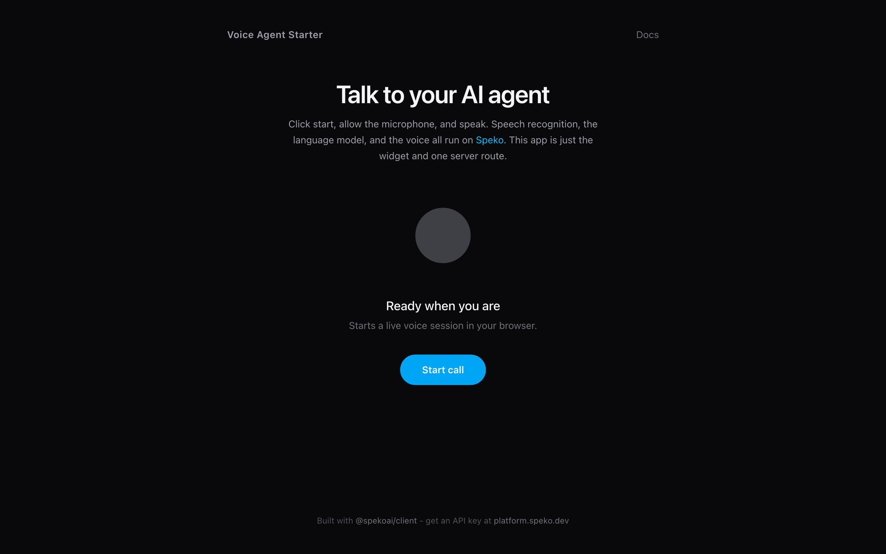

# Speko Voice Agent Starter

A production-ready AI voice agent in Next.js. Click a button, talk to an AI agent in your browser over WebRTC. Speech-to-text, the language model, and text-to-speech all run on [Speko](https://speko.ai)'s platform - this app needs exactly one secret: `SPEKO_API_KEY`.

[](https://vercel.com/new/clone?repository-url=https%3A%2F%2Fgithub.com%2FSpekoAI%2Fvoice-agent-starter&env=SPEKO_API_KEY&envDescription=Speko%20API%20key%20(sk_live_...)%20-%20create%20one%20at%20platform.speko.ai%2Fagents%2Fkeys&envLink=https%3A%2F%2Fplatform.speko.ai%2Fagents%2Fkeys&project-name=speko-voice-agent&repository-name=speko-voice-agent) [](https://exe.dev/new?repo=https://github.com/SpekoAI/voice-agent-starter)



## Quickstart

1. **Get an API key** - sign up at [platform.speko.ai](https://platform.speko.ai) and create a key under [API keys](https://platform.speko.ai/agents/keys) (starts with `sk_live_`).
2. **Set the env var** - `cp .env.example .env.local` and paste your key.
3. **Run it** - `pnpm install && pnpm dev`, open [http://localhost:3000](http://localhost:3000), click **Start call**.

Or skip local setup entirely and use the **Deploy** button above - Vercel prompts for `SPEKO_API_KEY` during setup.

## How it works

```
Browser                          Your server                   Speko
  |                                   |                          |
  |  POST /api/session                |                          |
  | --------------------------------> |  POST /v1/sessions       |
  |                                   |  (Bearer SPEKO_API_KEY)  |
  |                                   | -----------------------> |
  |   { transportToken, transportUrl } <----------------------- |
  | <-------------------------------- |                          |
  |                                                              |
  |  VoiceConversation.create({ transportToken, transportUrl }) |
  |  WebRTC: mic audio up, agent audio + live transcript down   |
  | <==========================================================> |
```

Three files matter:

| File | What it does |
| --- | --- |
| `app/api/session/route.ts` | Server route. Mints a short-lived voice session with your `SPEKO_API_KEY`. The key never reaches the browser - the client only gets a token scoped to one conversation. |
| `components/VoiceAgent.tsx` | Client widget. Joins the session with [`@spekoai/client`](https://www.npmjs.com/package/@spekoai/client), renders call state, live transcript, mute, and end-call. |
| `app/page.tsx` | The page. Swap in your own layout - the widget is self-contained. |

There is no model code, no audio plumbing, and no second LLM provider in this repo. The agent's brain (STT -> LLM -> TTS pipeline, provider routing, failover) runs on Speko.

## Environment variables

| Variable | Required | Description |
| --- | --- | --- |
| `SPEKO_API_KEY` | Yes | Speko API key from [platform.speko.ai/agents/keys](https://platform.speko.ai/agents/keys). Server-side only. |
| `SPEKO_AGENT_ID` | No | Use a saved agent from [platform.speko.ai/agents](https://platform.speko.ai/agents) (its prompt, voice, and routing) instead of the inline defaults. |
| `SPEKO_API_BASE` | No | API base URL. Defaults to `https://api.speko.dev`. |

## Customize the agent

Two ways, pick one:

- **In code**: edit `SYSTEM_PROMPT` (and optionally `intent`, `voice`, `firstMessage`) in `app/api/session/route.ts`. See the [sessions API reference](https://docs.speko.dev) for every knob - voice selection, provider constraints, turn handling, background audio, and more.
- **In the dashboard**: create an agent at [platform.speko.ai/agents](https://platform.speko.ai/agents), then set `SPEKO_AGENT_ID`. Non-engineers can iterate on the prompt and voice without touching this repo.

## Production notes

- `/api/session` is deliberately unauthenticated in this starter. Anyone who can reach your deployment can start a call billed to your Speko account. Add auth (or at least rate limiting) before promoting a public deployment.
- Session tokens are short-lived (15 minutes by default via `ttlSeconds`) and scoped to a single conversation.

## Stack

- [Next.js](https://nextjs.org) App Router + TypeScript
- [`@spekoai/client`](https://www.npmjs.com/package/@spekoai/client) - browser voice SDK (WebRTC)
- [Tailwind CSS v4](https://tailwindcss.com)
- Package manager: [pnpm](https://pnpm.io) (npm / bun / yarn work too)

## License

[MIT](LICENSE)
